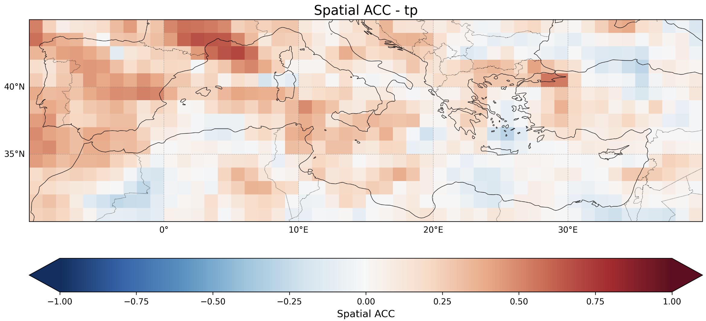
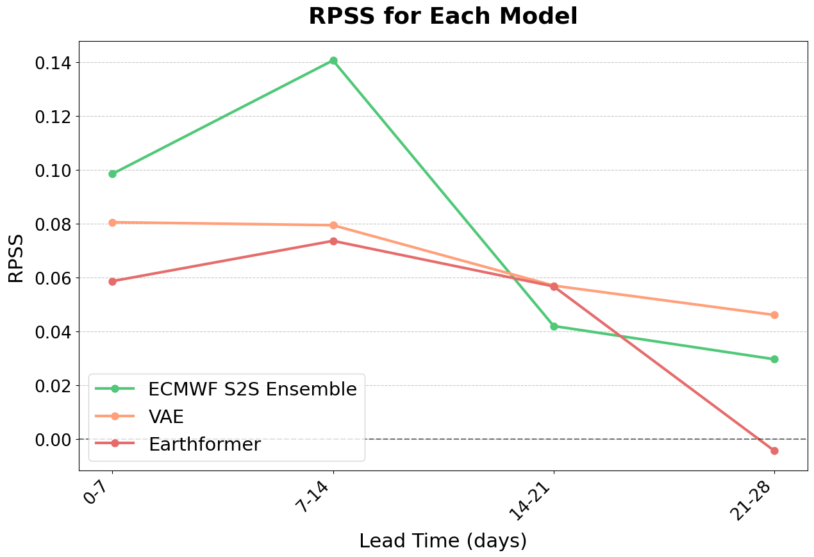
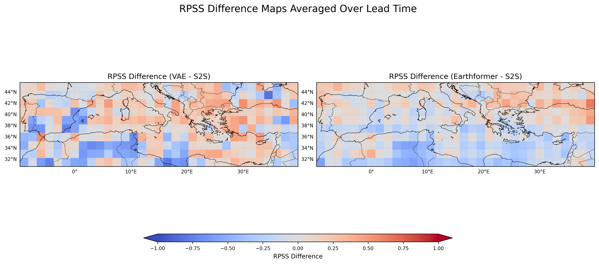

<h1 align="center">S2S Precipitation Forecasting in the Mediterranean Area</h1>
This research project was conducted at the Institute for Environmental Studies from May to October as part of my end-of-studies internship for MVA and SDI Masters.

## I- Project Overview
### a. Description
This project focuses on **predicting precipitation during the cold season (October-March) in the Mediterranean region**, specifically at lead times of 1 to 4 weeks. 

The project aims to develop two distinct models to generate probabilistic forecasts for weekly precipitation:

1. **To build upon Earthformer**, a 3D convolutional network transformer, adapting it for S2S forecasting in the Mediterranean region and generating ensemble members through weight initialization.

2. **To develop a 3D Variational Autoencoder (VAE)**, leveraging its stochastic structure to generate ensembles by sampling from the latent space.

### b. Results
In this research, we aimed at predicting precipitations over Mediterranean at S2S timescale. We compared two methods of generating ensemble forecasts—weight initialization with the Earth- former and stochastic latent space with the VAE—to evaluate our ability to capture variability in the data and assess the forecast skill achieved.

#### Predictability patterns
The strong correlations of winter precipitation anomalies in the **Alps and the Iberian Peninsula** suggest that these regions may be more predictable. This could be linked to the fact that both areas are affected by teleconnections such as NAO, which have been shown to enhance the predictability of dry conditions in spring and winter.



-> Significance test could be conducted to verify these patterns.

#### Comparison with ECMWF

To assess overall performance, we compared the probabilistic metrics of the two models with the ECMWF S2S forecast. As a main result, this comparison showed that our two models have **superior skill at lead times of 14-21 days**, as we can observe on the figure below showing **RPSS relative to Climatology Mean**.



It also demonstrated **higher predictability for specific regions**, particularly the Eastern Mediterranean, compared to ECMWF.


## II- Repo stucture
This repository is organized into two primary codebases: Earthformer and VAE. The ```notebook ```folder also contains various data verification processes, plot generation, and exploratory experiments.

### a. Earthformer
The Earthformer folder includes the main codebase for dataset construction, utility functions, and the comparison pipeline with ECMWF S2S forecasts. The key directories are as follows:

- **data**: Contains the three main classes used for dataset construction.
  - ```dataset.py```: Defines the PyTorch Dataset class, handling the overall dataset assembly. This class calls:
     - ```area_dataset.py``` for preprocessing every regional dataset (scaling, resolution, statistics)
    - ```temporal_aggregator.py``` for temporal aggregation.

- **s2s_evaluation**: ENables comparisons of both models with ECMWF S2S Ensemble Forecasts. Includes:
  - ```evaluation.ipynb```: Notebook for preprocessing and generating comparison plots.
  - ```download_s2s.py```: Script to download the S2S dataset.
  - ```generate_pred.py```: Produces aligned predictions with ECMWF time points.

```
📦 src
 ┣ 📂 configs
 ┣ 📂 data
 ┃ ┣ 📜 area_dataset.py
 ┃ ┣ 📜 dataset.py
 ┃ ┗ 📜 temporal_aggregator.py
 ┣ 📂 evaluation
 ┃ ┣ 📜 ensemble_eval.py
 ┃ ┗ 📜 test.py
 ┣ 📂 interpretability
 ┣ 📂 model
 ┃ ┣ 📂 experiments
 ┃ ┣ 📜 earthformer_model.py
 ┃ ┣ 📜 earthformer_prob_model.py
 ┣ 📂 nets
 ┃ ┗ 📜 cuboid_transformer.py
 ┣ 📂 s2s_evaluation
 ┃ ┣ 📜 evaluation.ipynb          # Contains preprocessing and all the comparison plots 
 ┃ ┣ 📜 download_s2s.py           # Download S2S dataset script
 ┃ ┣ 📜 generate_pred.py          # Generate the right prediction to align with ECMWF times
 ┗ 📂 utils
   ┣ 📜 __init__.py
   ┣ 📜 climatology.py
   ┣ 📜 entire_era.py
   ┣ 📜 enums.py
   ┣ 📜 hierarchical_aggregator.py
   ┣ 📜 spi.py
 ```

### b. VAE

The VAE folder relies on components from the Earthformer codebase and includes two VAE architectures in the ```model_vae``` folder.


```
📦src
 ┣ 📂data
 ┃  ┣ 📜 __init__.py
 ┃  ┣ 📜 ensemble_eval.py  # Ensemble eval (RPSS, BSS)
 ┃  ┣ 📜 eval.py           # Deterministic eval (RMSE,R2, ACC)
 ┃  ┗ 📜 main.py
 ┣ 📂 model_vae
 ┃ ┣ 📜 __init__.py
 ┃ ┣ 📜 vae_bis.py         # VAE with 3D Latent Space
 ┃ ┣ 📜 vae_model.py       # Core VAE model definition
 ┃ ┣ 📜 vae_net.py         # VAE with 1D Latent Space + adaptive stride
 ┃ ┗ 📜 vae_train_job.sh   # Training script for VAE
 ```


## III- Prerequisites
Before your start, make sure you have met the following requirements
- Python  installed (my version was **3.11.3**) 
- Create a virtual environment 
- Export the python path to tell your operating system where to find specific Python packages or scripts. 

```
pip install -r  requirements.txt
`````

